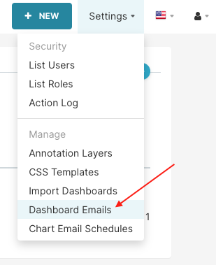
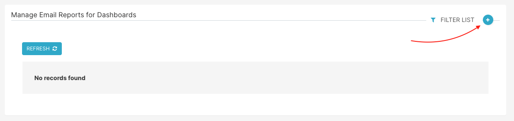
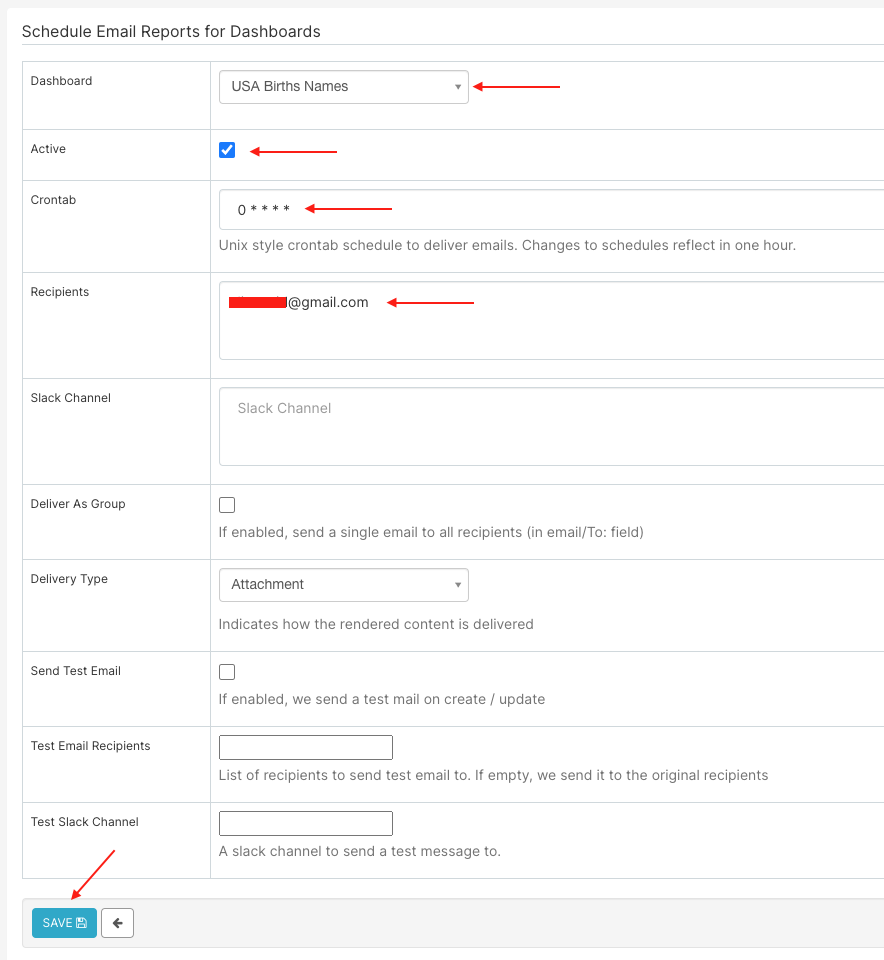
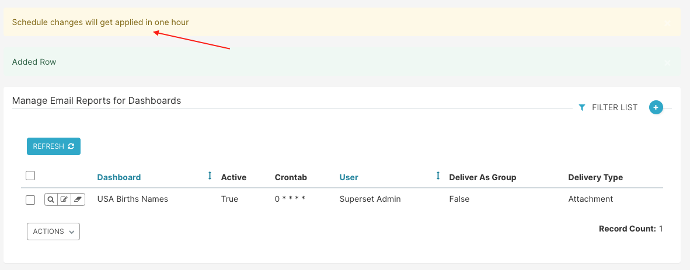
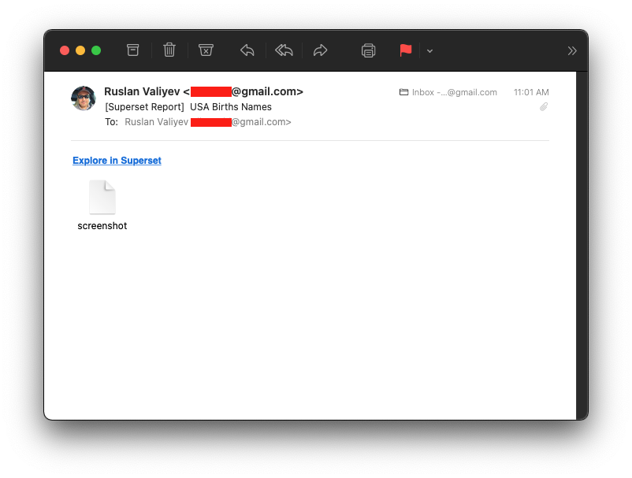
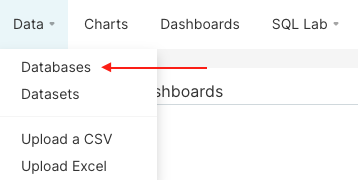
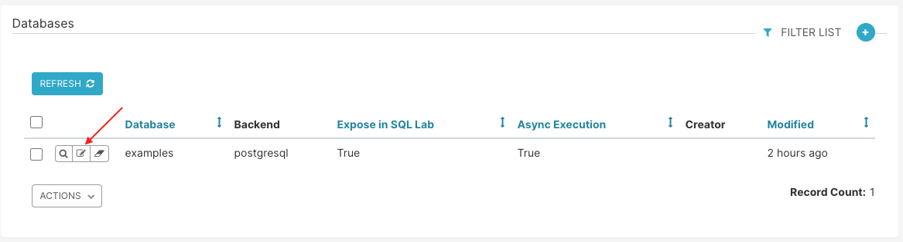
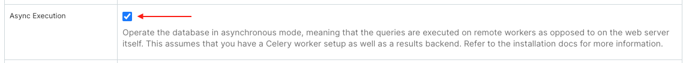
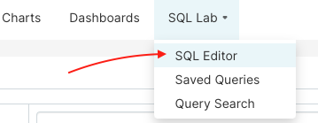
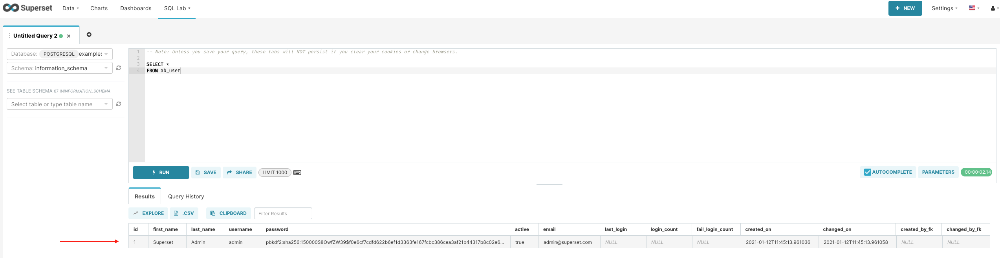

# Introduction

The following guide describes how to start [Apache Superset](https://superset.apache.org/) in a Docker environment using existing PostgreSQL and Redis servers that will be accessed by Superset and Celery over network.

All code is based on https://github.com/apache/superset/tree/latest (tag: latest)

Files and directories that are not required (such as code used for testing, various .md files, etc. have been removed to keep this repository as small as possible).

# Requirements

Docker host should have at least 3GB free memory (not cached) in order to be able to build and run the containers.

Ideally, at least 8GB memory is recommended.

### 1. Docker
<details>
  <summary>Build version</summary>

```shell
# docker info
Client:
 Context:    default
 Debug Mode: false
 Plugins:
  app: Docker App (Docker Inc., v0.9.1-beta3)
  buildx: Build with BuildKit (Docker Inc., v0.5.1-docker)

Server:
Containers: 1
Running: 0
Paused: 0
Stopped: 1
Images: 14
Server Version: 20.10.2
Storage Driver: overlay2
Backing Filesystem: extfs
Supports d_type: true
Native Overlay Diff: true
Logging Driver: json-file
Cgroup Driver: cgroupfs
Cgroup Version: 1
Plugins:
Volume: local
Network: bridge host ipvlan macvlan null overlay
Log: awslogs fluentd gcplogs gelf journald json-file local logentries splunk syslog
Swarm: inactive
Runtimes: io.containerd.runc.v2 io.containerd.runtime.v1.linux runc
Default Runtime: runc
Init Binary: docker-init
containerd version: 269548fa27e0089a8b8278fc4fc781d7f65a939b
runc version: ff819c7e9184c13b7c2607fe6c30ae19403a7aff
init version: de40ad0
Security Options:
apparmor
seccomp
Profile: default
Kernel Version: 4.19.0-13-amd64
Operating System: Debian GNU/Linux 10 (buster)
OSType: linux
Architecture: x86_64
CPUs: 4
Total Memory: 7.786GiB
Name: debian
ID: REPR:2AIS:RHQA:WWPD:SH6B:3IPX:V4UW:PXAC:FQWK:M3S5:EKPF:6DCF
Docker Root Dir: /var/lib/docker
Debug Mode: false
Registry: https://index.docker.io/v1/
Labels:
Experimental: false
Insecure Registries:
127.0.0.0/8
Live Restore Enabled: false

WARNING: No swap limit support
```
</details>

### 2. Docker Compose
<details>
  <summary>Build version</summary>

```shell
# docker-compose version
docker-compose version 1.27.4, build 40524192
docker-py version: 4.3.1
CPython version: 3.7.7
OpenSSL version: OpenSSL 1.1.0l  10 Sep 2019
```
</details>

# Configuration
**IMPORTANT:** This build assumes you have existing instances of PostgreSQL and Redis. Additionally, you should have SMTP details in order to configure email reports.

### 1. Required Settings
**IMPORTANT:** Mandatory configuration settings for DB and Redis must be configured in `docker/.env`. Any other settings that could be reloaded on the fly without having to restart any containers must be configured in `docker/pythonpath_dev/superset_config.py`

First, open `docker/.env` in your editor and specify `DATABASE_*`, `REDIS_*` settings.

Example:
```shell
# PostgreSQL configuration
DATABASE_DIALECT=postgresql
DATABASE_HOST=172.17.0.1
DATABASE_PORT=5432
DATABASE_DB=superset
DATABASE_USER=superset
DATABASE_PASSWORD=superset

# Redis configuration
REDIS_HOST=172.17.0.1
REDIS_PORT=6379
REDIS_CELERY_DB=0
REDIS_RESULTS_DB=1
```

Secondly, specify your SMTP settings by editing `docker/pythonpath_dev/superset_config.py`:
```shell
# Email settings start here
ENABLE_SCHEDULED_EMAIL_REPORTS=True
SMTP_HOST='smtp.gmail.com'
SMTP_STARTTLS=True
SMTP_SSL=False
SMTP_USER='xxx@gmail.com'
SMTP_PORT=587
SMTP_PASSWORD='xxx'
SMTP_MAIL_FROM='xxx@gmail.com'
EMAIL_NOTIFICATIONS=True
EMAIL_REPORT_FROM_ADDRESS='xxx@gmail.com'
EMAIL_REPORT_BCC_ADDRESS=None
# This user needs to be an admin user
EMAIL_REPORTS_USER='admin'
EMAIL_REPORTS_SUBJECT_PREFIX="[Superset Report] "
EMAIL_REPORTS_WEBDRIVER='firefox'
```

### 2. Flask Port
By default, Superset will be exposed to `0.0.0.0:8088` so you would access it from your browser at http://docker_host:8088

If you wish to change the port, open `docker-compose.yml` and replace `8088` with a desired port. For instance, to change to `8080` on the host but keep it on `8088` inside the container you would only need to modify the `ports` part like this:

```shell
  superset:
    build: *superset-build
    container_name: superset_app
    command: ["flask", "run", "-p", "8088", "--with-threads", "--reload", "--debugger", "--host=0.0.0.0"]
    env_file: docker/.env
    restart: unless-stopped
    ports:
      - 8080:8088
    volumes: *superset-volumes
```

### 3. Superset Admin User
By default, `docker/docker-init.sh` creates a user `admin` with password `admin`.

You would want to change that by editing the file and modifying the following section:
```shell
superset fab create-admin \
              --username admin \
              --firstname John \
              --lastname Doe \
              --email admin@superset.com \
              --password admin
```

# Installation

Once you have customized settings as per earlier *Configuration*, you're ready to build the images.

By default, there are 5 x services defined in `docker-compose.yml`

1. `superset` &mdash; used to run Flask
2. `superset-init` &mdash; used to initialize Superset by calling `docker/docker-init.sh`
3. `superset-node` &mdash; used to install the frontend and other NPM dependencies
4. `superset-worker` &mdash; used to invoke tasks in an async way (Celery Worker)
5. `superset-beat` &mdash; used to schedule tasks (Celery Beat)

### 1. Build Docker Images
Build the images from the same directory where you have `Dockerfile` and `docker-compose.yml`:
```shell
docker-compose build
```

**NOTE:** It may take up to 15-30 minutes to complete depending on your host system.

Once the build is completed, the images should be ready to run the containers:
```shell
# docker images
REPOSITORY                           TAG       IMAGE ID       CREATED          SIZE
incubator-superset_superset-beat     latest    7af775729b20   50 seconds ago   2.76GB
incubator-superset_superset-init     latest    7af775729b20   50 seconds ago   2.76GB
incubator-superset_superset-worker   latest    7af775729b20   50 seconds ago   2.76GB
incubator-superset_superset          latest    7af775729b20   50 seconds ago   2.76GB
<none>                               <none>    368ab294977e   3 minutes ago    2.39GB
<none>                               <none>    304008b03b53   5 minutes ago    2.47GB
<none>                               <none>    4244c88f5ca8   13 minutes ago   1.21GB
<none>                               <none>    7e136c6b1e47   20 minutes ago   879MB
node                                 12        9756a2cb8e53   5 hours ago      917MB
python                               3.7.9     978a47fa762f   3 weeks ago      876MB
```

### 2. Create Docker Containers
Next step would be to start the environment. For detached mode, add `-d` at the end:

```shell
docker-compose up
```

When the environment is fully loaded (which will also take couple of minutes), the `docker-compose` log will say:
```shell
superset_node      | Version: typescript 3.8.3
superset_node      | Time: 84583ms
superset_node      | <s> [webpack.Progress] 100%
superset_node      |
superset_node      |    8390 modules
```

You can now proceed to accessing Superset in your browser for further configuration.

# Enable Email Reports for Dashboards
### 1. Navigate to _Settings > Dashboard Emails_
Open your browser and navigate to http://docker_host:8080 and login with the credentials in _Configuration, Step 3_. Default is `admin:admin`



### 2. Click on the plus (+) button to create a new report



### 3. Provide details for the new report
- Dashboard: select one from the dropdown. It will be attached to the email as an image.
- Active: make sure the checkbox is checked
- Crontab: specify the crontab schedule. Please note that changes are reflected once per hour.
- Recipients: provide one or more emails



**NOTE:** Changes are applied once an hour.



**NOTE:** To customize email subject, email from address, etc., you need to modify `docker/pythonpath_dev/superset_config.py`

### 4. When Celery Beat has picked up your task, you should receive an email



### 5. You should also see the results in `superset_worker` logs
```shell
[2021-01-12 17:24:31,681: INFO/ForkPoolWorker-1] Starting report for slack: None and recipients: xxx@gmail.com.
[2021-01-12 17:24:31,729: INFO/ForkPoolWorker-1] Init selenium driver
[2021-01-12 17:25:17,202: INFO/ForkPoolWorker-1] Sent an email to ['xxx@gmail.com']
[2021-01-12 17:25:18,944: INFO/ForkPoolWorker-1] Task email_reports.send[45ff7a7b-8423-4e30-853d-1aae94d52168] succeeded in 47.29482863699377s: None
```

# Enable Celery for SQL Queries
### 1. Navigate to _Data > Databases_



### 2. Click Edit on the database which you want to enable async querying for



### 3. Make sure _Async Execution_ is checked and click Save



### 4. Test using SQL Lab
Now that the database is configured with _Async Execution_, we can perform a test using _SQL Lab_.





On a successful run, you should see in the `superset_worker` container logs as well in the SQL Lab Results table.
```shell
[2021-01-12 16:27:53,828: INFO/MainProcess] Received task: sql_lab.get_sql_results[e2636fd3-23fd-43ca-b3dd-bb74a7c2e0d0]
[2021-01-12 16:27:53,868: INFO/ForkPoolWorker-1] Query 5: Executing 1 statement(s)
[2021-01-12 16:27:53,868: INFO/ForkPoolWorker-1] Query 5: Set query to 'running'
[2021-01-12 16:27:53,905: INFO/ForkPoolWorker-1] Query 5: Running statement 1 out of 1
[2021-01-12 16:27:53,942: DEBUG/ForkPoolWorker-1] Query 5: Handling cursor
[2021-01-12 16:27:53,959: DEBUG/ForkPoolWorker-1] Query 5: Fetching data for query object: {'changedOn': datetime.datetime(2021, 1, 12, 16, 27, 53, 926838), 'changed_on': '2021-01-12T16:27:53.926838', 'dbId': 1, 'db': 'examples', 'endDttm': None, 'errorMessage': None, 'executedSql': '-- Note: Unless you save your query, these tabs will NOT persist if you clear your cookies or change browsers.\n\nSELECT *\nFROM ab_user\nLIMIT 1000', 'id': 'Wgaaxhx4_', 'queryId': 5, 'limit': 1000, 'progress': 0, 'rows': None, 'schema': 'information_schema', 'ctas': False, 'serverId': 5, 'sql': '-- Note: Unless you save your query, these tabs will NOT persist if you clear your cookies or change browsers.\n\nSELECT *\nFROM ab_user', 'sqlEditorId': 'XdLLR7rJU', 'startDttm': Decimal('1610468873760.536900'), 'state': 'running', 'tab': 'Untitled Query 2', 'tempSchema': 'information_schema', 'tempTable': '', 'userId': 1, 'user': 'Superset Admin', 'resultsKey': None, 'trackingUrl': None, 'extra': {'progress': 'Running statement 1 out of 1'}}
[2021-01-12 16:27:53,959: DEBUG/ForkPoolWorker-1] Query 5: Fetching cursor description
[2021-01-12 16:27:53,980: INFO/ForkPoolWorker-1] Query 5: Storing results in results backend, key: 2eb487d8-b758-43a9-8d87-d56aa5f0c453
[2021-01-12 16:27:53,990: INFO/ForkPoolWorker-1] Task sql_lab.get_sql_results[e2636fd3-23fd-43ca-b3dd-bb74a7c2e0d0] succeeded in 0.16106307299924083s: None
```

# Troubleshooting
Note: you may get the following errors depending on how your Docker host is configured.

### Problem
#### Error: ENOSPC: System limit for number of file watchers reached

### Solution
Increase the amount of itnotify watchers on the Docker host:
```shell
echo "fs.inotify.max_user_watches=524288" >> /etc/sysctl.conf && sysctl -p
```
---
### Problem
#### Memory Insufficient Warning

The script `docker/frontend-mem-nag.sh` is used to warn in case there is not enough memory to run the frontend. Minimum is 3GB.

If you see an error that looks like this, proceed to the solution under:
```shell
    ===============================================
    ========  Memory Insufficient Warning =========
    ===============================================

    It looks like you only have XXX GB of
    memory free. Please increase your Docker
    resources to at least XXX GB

    ===============================================
    ========  Memory Insufficient Warning =========
    ===============================================
```
### Solution
1. Best solution: Increase memory on the Docker host
2. OK workaround: Drop caches and release unused memory:
```shell
sync; echo 1 > /proc/sys/vm/drop_caches
```

# FAQ

### Question: Where is Celery storing results?
It's using Redis. Result backend is configured in `docker/pythonpath_dev/superset_config.py`
```shell
CELERY_RESULT_BACKEND = f'redis://{REDIS_HOST}:{REDIS_PORT}/{REDIS_RESULTS_DB}'
```
You can check them at any time:
```shell
# redis-cli -n 1
127.0.0.1:6379[1]> keys *
1) "celery-task-meta-d17d5d71-cc39-4ff7-80b9-357b8304bdb8"
2) "celery-task-meta-e2636fd3-23fd-43ca-b3dd-bb74a7c2e0d0"
3) "celery-task-meta-dfc777e2-a6b6-4529-a487-06384658adb4"
```

### Question: How do I specify SMTP server, username, etc.?
See `docker/pythonpath_dev/superset_config.py` and specifically lines that start with `SMTP_`

### Question: Do I need to restart (`docker-compose down && docker-compose up`) on configuration changes?
Any changes made to `docker/.env` are loaded on initialization as anvironment variables and therefore require a restart.

However, changes made to `docker/pythonpath_dev/superset_config.py` or any files inside the `superset` or `superset-frontend` folders will automatically notify Docker to reload, therefore you do not need to restart.

### Question: I have specified my Email Dashboard Reports to be sent to me every 5 minutes, why am I getting them only once per hour?
There is currently an open bug to fix it: https://github.com/apache/superset/pull/11414
