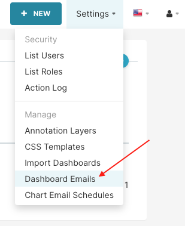
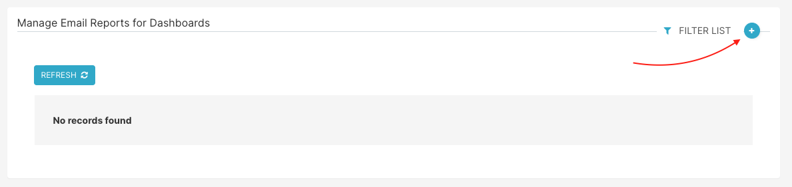
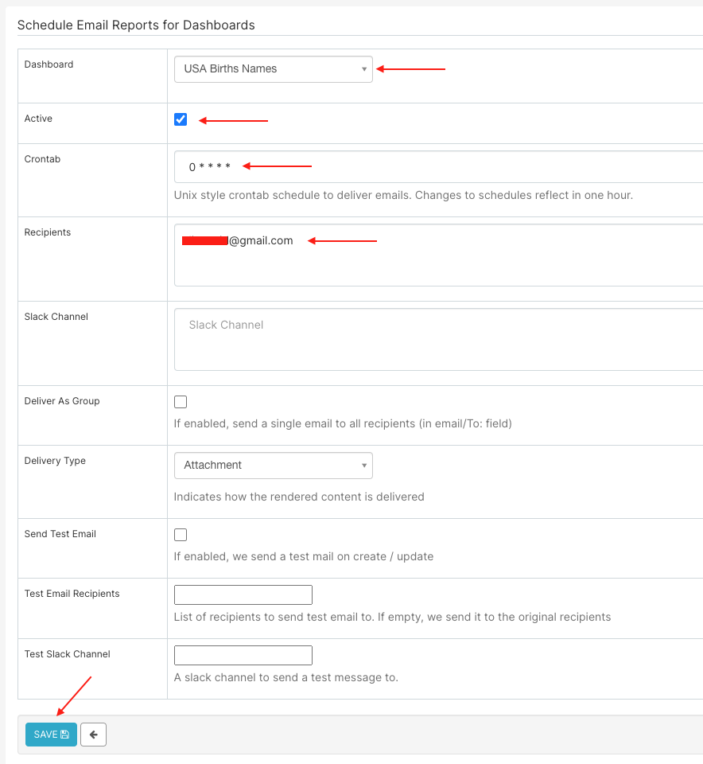
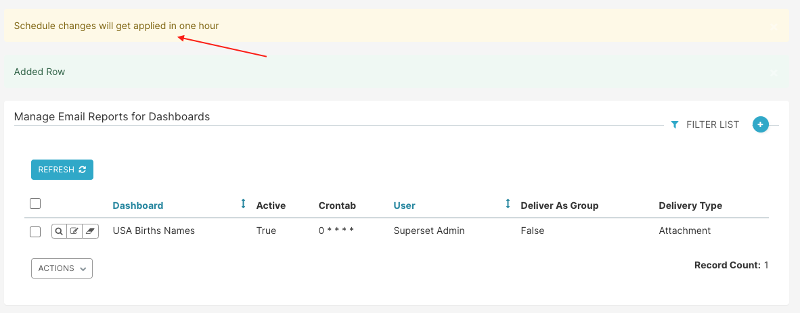
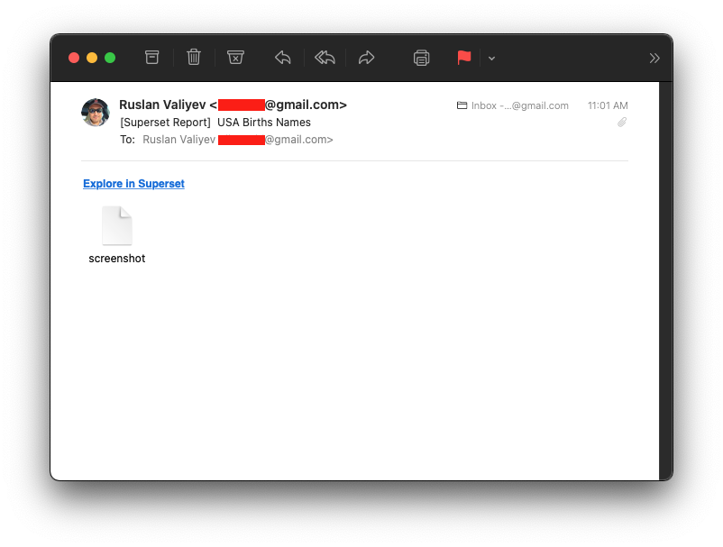
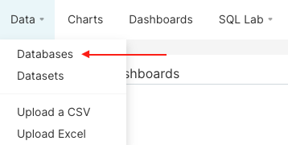
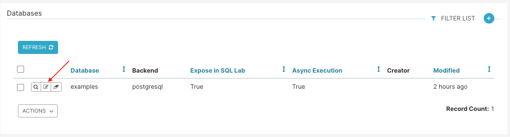
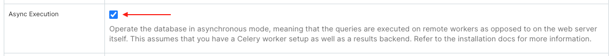
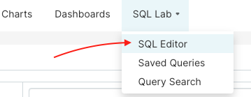
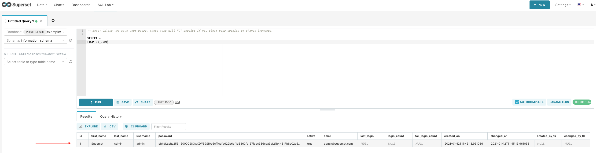

# Introduction

The following guide describes how to start [Apache Superset](https://superset.apache.org/) in a Docker environment using existing PostgreSQL and Redis servers that will be accessed by Superset and Celery over network.

All code is based on the official image: https://hub.docker.com/r/apache/incubator-superset

# Requirements

It is recommended to have at least 3GB available memory to run all containers.

Additionally, your host should have `Docker` and `Docker Compose` installed. This code was tested on the versions mentioned below.

### 1. Docker
<details>
  <summary>Build version</summary>

```shell
# docker info
Client:
 Context:    default
 Debug Mode: false
 Plugins:
  app: Docker App (Docker Inc., v0.9.1-beta3)
  buildx: Build with BuildKit (Docker Inc., v0.5.1-docker)

Server:
Containers: 1
Running: 0
Paused: 0
Stopped: 1
Images: 14
Server Version: 20.10.2
Storage Driver: overlay2
Backing Filesystem: extfs
Supports d_type: true
Native Overlay Diff: true
Logging Driver: json-file
Cgroup Driver: cgroupfs
Cgroup Version: 1
Plugins:
Volume: local
Network: bridge host ipvlan macvlan null overlay
Log: awslogs fluentd gcplogs gelf journald json-file local logentries splunk syslog
Swarm: inactive
Runtimes: io.containerd.runc.v2 io.containerd.runtime.v1.linux runc
Default Runtime: runc
Init Binary: docker-init
containerd version: 269548fa27e0089a8b8278fc4fc781d7f65a939b
runc version: ff819c7e9184c13b7c2607fe6c30ae19403a7aff
init version: de40ad0
Security Options:
apparmor
seccomp
Profile: default
Kernel Version: 4.19.0-13-amd64
Operating System: Debian GNU/Linux 10 (buster)
OSType: linux
Architecture: x86_64
CPUs: 4
Total Memory: 7.786GiB
Name: debian
ID: REPR:2AIS:RHQA:WWPD:SH6B:3IPX:V4UW:PXAC:FQWK:M3S5:EKPF:6DCF
Docker Root Dir: /var/lib/docker
Debug Mode: false
Registry: https://index.docker.io/v1/
Labels:
Experimental: false
Insecure Registries:
127.0.0.0/8
Live Restore Enabled: false

WARNING: No swap limit support
```
</details>

### 2. Docker Compose
<details>
  <summary>Build version</summary>

```shell
# docker-compose version
docker-compose version 1.27.4, build 40524192
docker-py version: 4.3.1
CPython version: 3.7.7
OpenSSL version: OpenSSL 1.1.0l  10 Sep 2019
```
</details>

# Configuration
**IMPORTANT:** This build assumes you have existing instances of PostgreSQL and Redis. Additionally, you should have SMTP details in order to configure email reports.

### 1. Required Settings
- Settings for DB and Redis should be configured in `./env`.

- Settings for SMTP should be configured in `./superset_config.py`

Firstly, open `./env` in your editor and specify `DATABASE_*`, `REDIS_*` settings.

Example:
```shell
# PostgreSQL configuration
DATABASE_DIALECT=postgresql
DATABASE_HOST=172.17.0.1
DATABASE_PORT=5432
DATABASE_DB=superset
DATABASE_USER=superset
DATABASE_PASSWORD=superset

# Redis configuration
REDIS_HOST=172.17.0.1
REDIS_PORT=6379
REDIS_CELERY_DB=0
REDIS_RESULTS_DB=1
```

Secondly, specify your SMTP settings by editing `./superset_config.py`:
```shell
# Email settings start here
ENABLE_SCHEDULED_EMAIL_REPORTS=True
SMTP_HOST='smtp.gmail.com'
SMTP_STARTTLS=True
SMTP_SSL=False
SMTP_USER='xxx@gmail.com'
SMTP_PORT=587
SMTP_PASSWORD='xxx'
SMTP_MAIL_FROM='xxx@gmail.com'
EMAIL_NOTIFICATIONS=True
EMAIL_REPORT_FROM_ADDRESS='xxx@gmail.com'
EMAIL_REPORT_BCC_ADDRESS=None
# This user needs to be an admin user
EMAIL_REPORTS_USER='admin'
EMAIL_REPORTS_SUBJECT_PREFIX="[Superset Report] "
EMAIL_REPORTS_WEBDRIVER='firefox'
```

### 2. Optional Settings & Requirements
If you need to add support for a custom DB such as [Clickhouse](https://superset.apache.org/docs/databases/clickhouse), add the respective library name in `./requirements.txt`

Example:

```shell
echo "sqlalchemy-clickhouse" >> ./requirements.txt
```

Detailed guides:

- https://preset.io/blog/2020-05-18-install-db-drivers
- https://superset.apache.org/docs/databases/dockeradddrivers

### 3. Flask Port
By default, Superset will be exposed to `0.0.0.0:8080` so you would access it from your browser at `http://docker_host:8080`

If you wish to change the port, open `docker-compose.yml` and replace `8080` with a desired port.
For instance, to change to `8088` on the host but keep it on `8080` inside the container you would only need to modify the `ports` part like this:

```shell
  superset:
    build: *superset-build
    container_name: superset_app
    env_file: .env
    restart: unless-stopped
    ports:
      - "0.0.0.0:8088:8080"
    volumes: *superset-volumes
```

**IMPORTANT:** If you are changing the default port `8080`, remember to update the following line in `superset_config.py`:
```shell
WEBDRIVER_BASEURL = "http://superset_app:8088/"
```

### 4. Superset Admin User
By default, `./superset-init.sh` creates a user `admin` with password `admin`.

You would want to change that by editing the file and modifying the following section:
```shell
superset fab create-admin \
       --username admin \
       --firstname Superset \
       --lastname Admin \
       --email admin@superset.com \
       --password admin
```

# Installation

Once you have customized settings as per earlier *Configuration*, you're ready to build the images.

By default, there are 5 x services defined in `./docker-compose.yml`

1. `superset` &mdash; used to run Superset itself
2. `superset-init` &mdash; used to initialize Superset by calling `./superset-init.sh`
3. `superset-worker` &mdash; used to invoke tasks in an async way (Celery Worker)
4. `superset-beat` &mdash; used to schedule tasks (Celery Beat)
5. `superset-flower` &mdash; used to provide a Web UI with Celery Flower

### 1. Build Docker Images
Build the images from the same directory where you have `./Dockerfile` and `./docker-compose.yml`:
```shell
docker-compose build --force-rm
```

Once the build is completed, the images should be ready to run the containers:
```shell
# docker images
REPOSITORY                  TAG       IMAGE ID       CREATED         SIZE
superset_superset-beat      latest    275826e4cc09   4 seconds ago   1.98GB
superset_superset-flower    latest    275826e4cc09   4 seconds ago   1.98GB
superset_superset-init      latest    275826e4cc09   4 seconds ago   1.98GB
superset_superset-worker    latest    275826e4cc09   4 seconds ago   1.98GB
superset_superset           latest    275826e4cc09   4 seconds ago   1.98GB
apache/incubator-superset   latest    7f3b64306e9e   4 days ago      1.45GB
```

### 2. Create Docker Containers
Next step would be to start the environment. For detached mode, add `-d` at the end:

```shell
docker-compose up
```

When the environment is fully loaded (which will also take couple of minutes), the `docker-compose` log will say:
```shell
superset_app       | Loaded your LOCAL configuration at [/app/pythonpath/superset_config.py]
superset_app       | 127.0.0.1 - - [14/Jan/2021:13:03:25 +0000] "GET /health HTTP/1.1" 200 2 "-" "curl/7.64.0"
```

You can now proceed to accessing Superset in your browser for further configuration.

# Enable Email Reports for Dashboards
### 1. Navigate to _Settings > Dashboard Emails_
Open your browser and navigate to http://docker_host:8080 and login with the credentials in _Configuration, Step 3_. Default is `admin:admin`



### 2. Click on the plus (+) button to create a new report



### 3. Provide details for the new report
- Dashboard: select one from the dropdown. It will be attached to the email as an image.
- Active: make sure the checkbox is checked
- Crontab: specify the crontab schedule. Please note that changes are reflected once per hour.
- Recipients: provide one or more emails



**NOTE:** Changes are applied once an hour.



**NOTE:** To customize email subject, email from address, etc., you need to modify `./superset_config.py`

### 4. When Celery Beat has picked up your task, you should receive an email



### 5. You should also see the results in `superset_worker` logs
```shell
[2021-01-12 17:24:31,681: INFO/ForkPoolWorker-1] Starting report for slack: None and recipients: xxx@gmail.com.
[2021-01-12 17:24:31,729: INFO/ForkPoolWorker-1] Init selenium driver
[2021-01-12 17:25:17,202: INFO/ForkPoolWorker-1] Sent an email to ['xxx@gmail.com']
[2021-01-12 17:25:18,944: INFO/ForkPoolWorker-1] Task email_reports.send[45ff7a7b-8423-4e30-853d-1aae94d52168] succeeded in 47.29482863699377s: None
```

# Enable Celery for SQL Queries
### 1. Navigate to _Data > Databases_



### 2. Click Edit on the database which you want to enable async querying for



### 3. Make sure _Async Execution_ is checked and click Save



### 4. Test using SQL Lab
Now that the database is configured with _Async Execution_, we can perform a test using _SQL Lab_.





On a successful run, you should see in the `superset_worker` container logs as well in the SQL Lab Results table.
```shell
[2021-01-12 16:27:53,828: INFO/MainProcess] Received task: sql_lab.get_sql_results[e2636fd3-23fd-43ca-b3dd-bb74a7c2e0d0]
[2021-01-12 16:27:53,868: INFO/ForkPoolWorker-1] Query 5: Executing 1 statement(s)
[2021-01-12 16:27:53,868: INFO/ForkPoolWorker-1] Query 5: Set query to 'running'
[2021-01-12 16:27:53,905: INFO/ForkPoolWorker-1] Query 5: Running statement 1 out of 1
[2021-01-12 16:27:53,942: DEBUG/ForkPoolWorker-1] Query 5: Handling cursor
[2021-01-12 16:27:53,959: DEBUG/ForkPoolWorker-1] Query 5: Fetching data for query object: {'changedOn': datetime.datetime(2021, 1, 12, 16, 27, 53, 926838), 'changed_on': '2021-01-12T16:27:53.926838', 'dbId': 1, 'db': 'examples', 'endDttm': None, 'errorMessage': None, 'executedSql': '-- Note: Unless you save your query, these tabs will NOT persist if you clear your cookies or change browsers.\n\nSELECT *\nFROM ab_user\nLIMIT 1000', 'id': 'Wgaaxhx4_', 'queryId': 5, 'limit': 1000, 'progress': 0, 'rows': None, 'schema': 'information_schema', 'ctas': False, 'serverId': 5, 'sql': '-- Note: Unless you save your query, these tabs will NOT persist if you clear your cookies or change browsers.\n\nSELECT *\nFROM ab_user', 'sqlEditorId': 'XdLLR7rJU', 'startDttm': Decimal('1610468873760.536900'), 'state': 'running', 'tab': 'Untitled Query 2', 'tempSchema': 'information_schema', 'tempTable': '', 'userId': 1, 'user': 'Superset Admin', 'resultsKey': None, 'trackingUrl': None, 'extra': {'progress': 'Running statement 1 out of 1'}}
[2021-01-12 16:27:53,959: DEBUG/ForkPoolWorker-1] Query 5: Fetching cursor description
[2021-01-12 16:27:53,980: INFO/ForkPoolWorker-1] Query 5: Storing results in results backend, key: 2eb487d8-b758-43a9-8d87-d56aa5f0c453
[2021-01-12 16:27:53,990: INFO/ForkPoolWorker-1] Task sql_lab.get_sql_results[e2636fd3-23fd-43ca-b3dd-bb74a7c2e0d0] succeeded in 0.16106307299924083s: None
```

# Troubleshooting
Note: you may get the following errors depending on how your Docker host is configured.

### Problem
#### Error: ENOSPC: System limit for number of file watchers reached

### Solution
Increase the amount of itnotify watchers on the Docker host:
```shell
echo "fs.inotify.max_user_watches=524288" >> /etc/sysctl.conf && sysctl -p
```

---

### Problem
#### Warning: Flask doesn't have cache configured
```shell
superset_worker | /usr/local/lib/python3.7/site-packages/flask_caching/__init__.py:192: UserWarning: Flask-Caching: CACHE_TYPE is set to null, caching is effectively disabled.
superset_worker | "Flask-Caching: CACHE_TYPE is set to null, "
```

### Solution
You can ignore this warning if you're not planning on enabling cache for Flask. To enable it, modify `./superset_config.py` to include:
```shell
CACHE_CONFIG = {
'CACHE_TYPE': 'redis',
'CACHE_DEFAULT_TIMEOUT': 60 * 60 * 24, # 1 day default (in secs)
'CACHE_KEY_PREFIX': 'superset_results',
'CACHE_REDIS_URL': 'redis://REDIS_HOST_IP:5379/0',
}
```
More info: https://github.com/apache/superset/issues/2137

# FAQ

### Question: Where does Celery store results?
It uses Redis. The result backend is configured in `./superset_config.py`
```shell
CELERY_RESULT_BACKEND = f'redis://{REDIS_HOST}:{REDIS_PORT}/{REDIS_RESULTS_DB}'
```
You can check the tasks at any time:
```shell
# redis-cli -n 1
127.0.0.1:6379[1]> keys *
1) "celery-task-meta-d17d5d71-cc39-4ff7-80b9-357b8304bdb8"
2) "celery-task-meta-e2636fd3-23fd-43ca-b3dd-bb74a7c2e0d0"
3) "celery-task-meta-dfc777e2-a6b6-4529-a487-06384658adb4"
```

Additionally, you can browse using Celery Flower at `http://docker_host:5555`

---

### Question: How do I specify SMTP server, username, etc.?
See `./superset_config.py` and specifically lines that start with `SMTP_`

---

### Question: Do I need to restart (docker-compose down && docker-compose up) on configuration changes?
Short answer: yes, you need to `docker-compose down && docker-compose up`

Long answer: while the Superset app is written to dynamically reload if any changes are made to its files (including `superset_config.py`),
we're mapping the config during container creation, hence the restart is required.

---

### Question: I have specified my Email Dashboard Reports to be sent to me every 5 minutes, why am I getting them only once per hour?
There is currently an open bug to fix it: https://github.com/apache/superset/pull/11414

For the time being, you can only schedule email reports to be sent once per hour or more.